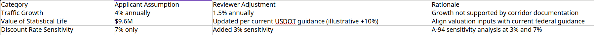
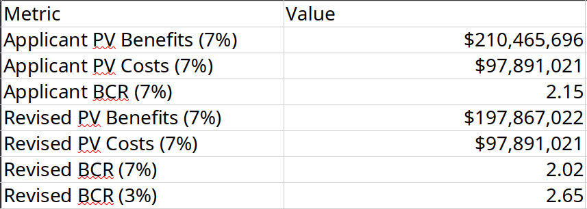

# CRISI-Style Benefit-Cost Analysis (BCA) Review – Mock Demonstration

## Executive Summary

A synthetic CRISI-style rail safety project was evaluated over a 20-year analysis period using a 7% real discount rate consistent with OMB Circular A-94 guidance.  

The applicant reported a Benefit-Cost Ratio (BCR) of **2.15 at 7%**.

Reviewer adjustments included moderating unsupported traffic growth assumptions and aligning valuation inputs with current federal guidance. Sensitivity analysis was also conducted at a 3% real discount rate.

Revised results:

- **BCR (7%)**: 2.02  
- **BCR (3%)**: 2.65  

The project remains economically justified under both discount rates, though results are sensitive to projected traffic growth.

## Reviewer Summary Snapshot

## Overview

This repository demonstrates a mock review of a CRISI-style Benefit-Cost Analysis (BCA) aligned with OMB Circular A-4 and OMB Circular A-94 guidance.

## Scope

The review includes:

- **Applicant Project Description (As Submitted)**  
  `Applicant_Project_Description_(As_Submitted).md`

- **Reconstruction of Applicant BCA**  
  `applicant_submission_build.ipynb`

- **Mock Applicant BCA Workbook**  
  `applicant_submission.xlsx`

- **Reviewer Adjustments and Evaluation**  
  `reviewer_analysis.ipynb`  
  `reviewer_summary.xlsx`  
  - Adjustment of assumptions  
  - Recalculation of Benefit-Cost Ratio (BCR)  
  - Documentation of review findings  

## Disclaimer

All data are synthetic and provided solely for methodological demonstration purposes.
